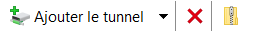

# Utilisation simple de l'application

## Installation

Pour une utilisation simple de l'application, il faut obtenir le setup, soit par mail soit par clé.
En double cliquant dessus, vous allez voir apparaître une fenêtre d'installation qui vous demande de choisir où vous voulez stocker l'application. 

Il est parfois nécessaire de placer l'application dans une exclusion de votre antivirus (cela dépend de votre antivirus) pour éviter qu'il ne supprime l'application en pensant que c'est un virus.

Il faut par ailleurs un VPN (et une connection internet) pour que l'application obtienne les droits d'aller sur la base de données. Pour cela, télécharger Wireguard sur leur site https://www.wireguard.com/install/, puis lancer leur application, ajoutez un tunnel en important un fichier .conf qui est considéré comme libre (renseignez vous auprès des autres utilisateurs du VPN de Zabé pour connaître les configurations disponibles restantes).


Maintenant, il ne vous reste plus qu'à rentrer dans le dossier /Générateur de rapport, où vous trouverez l'application sous le nom Générateur de rapport.exe. Ouvrez là en double cliquant dessus.
(vous pouvez aussi créer un raccourci en cliquant droit sur l'application, Créer un raccourci, et copier coller ce raccourci où vous le souhaitez, le bureau par exemple)

## Utilisation

### Onglet créateur de livrables

Vous arrivez donc sur une interface qui vous permet de créer des livrables. 
Pour ajouter une campagne dans la création de livrable, écrivez son nom du type 'AG-003-01', puis "Ajouter" cette référence (la touche Enter fonctionne aussi). Une sécurité est placée pour éviter les erreurs : si la référence précisée n'est pas dans la base de données ou a déjà été ajoutée, rien ne se passera.
Un menu déroulant permet de choisir la version de la base de données traitées voulue pour la génération de rapport. Par défaut, la version choisie est la dernière en date. 
En fonction du rapport désiré, une fenêtre demande le dossier dans lequel le rapport sera sauvegardé va apparaître.

### Précision sur l'onglet word

Pour créer un rapport d'expérimentation, il faut entrer le nom de la campagne et faire ajouter. Il est possible d'en ajouter plusieurs, que l'on voit en dessous. On choisit la version que l'on souhaite utiliser pour les références, la dernière étant sélectionnée par défaut. Après avoir cliquez sur "Rapport d'expérimentation", on précise en cochant ou non la case "Agence de l'eau" si c'en est une. Ensuite, on précise dans le champ "Numéro de la campagne", le numéro de celle-ci dans l'année. Si rien n'est renseigné, il y aura des "XX" à la place. Ce choix s'applique pour tous les rapports sélectionnés, donc si ce nombre est différent pour chacun, il faut les lancer un par un.

Dans le dossier de photo il faut qu'il y ait des dossiers nommés en fonction d'un point de mesure (ex : AG-003-01-01-01), et que dans chacun de ces dossiers il y ait 4 photos, de 4 natures différentes (amont, aval, panorama, zoom). Les photos doivent respecter la nomenclature suivant : "stepXX_PDA1_AG-003-01-01-01_Amont_5445664_65454.png". Les éléments importants sont la séparation par des Underscores (_, touche 8), que le 3e élément (ainsi séparé) soit la référence du point de mesure (ex : AG-003-01-01-01) et le 4e soit le point de vue de la photo (amont, aval, panorama, zoom). 

Par ailleurs, pour faire les cartes il faut un compte sur Mapbox, lorsque ceci est fait il faut changer la variable 'ACCESS_TOKEN_MAPBOX' dans env.py par la clef du compte. Celle-ci se trouve sur le site Mapbox.com, dans Account, il faut copier la Default public token.


### Onglet Gestionnaire de base de données

Cet onglet permet de changer de mettre à jour la base de données traitées ou de changer totalement de version.
Si vous avez connaissance d'ajout de données brutes (point de mesure, résultats divers, modifications ...) vous pouvez rafraîchir la base de données traitées avec le bouton "Rafraîchir la base de données traitées" qui gèlera l'application le temps de mettre à jour l'entièreté des données traitées. Vous avez la possibilité de choisir la version à mettre à jour entre une en particulier ou toutes d'un coup (cela va les mettre à jour une à une). 
Si vous avez besoin de créer une nouvelle version, veuillez renseigner le ficher excel contenant les références de calculs et de seuils dans en cliquant sur "Choisir le fichier excel de référence". Cela va automatiquement inscrire les deux informations possibles de la version à savoir la date (celle du jour actuel) ainsi qu'un éventuel commentaire que vous voulez préciser à la nouvelle version. Il ne reste plus qu'à cliquer sur "Ajouter cette version" qui remplira dans la base de données traitées une nouvelle série de données traitées calculées à partir des références précisées ave le fichier excel. Cela peut prendre une dizaine de minutes en fonction de la vitesse de connection de vogtre appareil.

Si vous voulez changer les éléments sélectionnées dans l'onglet NQE Biote, veuillez les renseigner dans /calcul/chemistry/nqe dans les dictionnaires correspondants.


# Utilisation avancée (pour mise à jour ou débugage)
## Prérequis 

Les étapes nécessaires sont :
- Avoir Python sur son ordinateur.
- Avoir le dossier du projet 
- Avoir le fichier env.py
- Télécharger les dépendances
- Avoir le VPN de Zabé (Wiregard)
- Avoir la page de garde (word), la page de fin (png) ainsi que le carre_blanc.png dans le dossier Ressources (uniquement pour la création de rapport d'expérimentation)

Pour avoir l'application , il est nécessaire d'avoir python sur son ordinateur.
Vous pouvez télécharger python via leur site https://www.python.org/downloads/. Lors de l'installation, assurez vous d'avoir la case 'Add to PATH' (Ajouter au PATH) cochée.

Pour avoir le dossier sur cela deux choix possibles :
- l'avoir sur une clé et le copier coller
- cloner le projet de github. Pour cela, il faut télécharger git sur son appareil et lancer dans une invite de commande :
```
git clone https://github.com/CDL-Biomae/report-generator
```
Cela va créer le dossier là où l'invite de commande a été lancé. Ensuite il faut placer le fichier env.py qui ne peut se transmettre par github mais entre particulier (clé USB, mail ...). 
Dans ce même fichier ajouter les coordonnées de la base de données telle que vous le souhaitez pour vous connectez (les variables commençant par DATABASE).
A partir de ce moment, pour lancer le programme, il faut au préalable installer les dépendances indiquées dans requires.txt.
Pour les installer, écrire les commandes suivantes dans un invite de commandes (il faut avoir au minimum python installé sur votre appareil ainsi que dans le PATH):
```
pip install --upgrade pip
pip install -r requires.txt
```

Assurez-vous d'avoir le fichier env.py dans le même dossier que requires.txt. Il doit figurer dans env.py les identifiants de la base de données à laquelle vous souhaitez vous connectez. DATABASE_USER, DATABASE_PASSWORD ET DATABASE_IP sont ces identifiants.
DATABASE_RAW et DATABASE_TREATED sont fournis par Zabé comme étant le nom de base respectivement de la base de données brutes et traitées.

Pour avoir le droit de se connecter à la base de données, il faut aussi installer le VPN de Zabé sur son ordinateur (WireGard). Utilisez une des configuration non utilisée par d'autre. Pour ajouter une configuration, cliquez sur ajouter un tunnel 

## Lancer l'application

- Pour créer l'application en fichier .exe, il faut lancer la ligne de commande (avec le module pyinstaller normalement déjà installé grâce aux dépendances de requires.txt) :
```
pyinstaller --onefile -w -i icon.ico app.py
```
(ici icon.ico est l'icône choisie pour l'application)
Un dossier /dist va apparaître contenant l'application. Pour son bon fonctionnement il faut placer cette application dans le dossier principal du projet. Ensuite, libre à vous de créer un raccourci sur votre bureau par exemple.
Il est possible que l'application soit interprétée par votre antivirus comme un cheval de Troie. Ne possédant pas de certificat, le fichier n'est pas répertoriée dans les applications dites sécurisées de Windows. En effet, sa capacité à piocher dans vos fichiers word et excel pour en créer de nouveau peut être mal interprété. Pour remédier à ce problème, il faut mettre le projet entier dans l'exclusion de votre antivirus.     

- Pour lancer l'application en local, écrivez dans un terminal de commande la ligne suivante :
```
python app.py
```
Cela peut prendre de 2sec à 30 sec en fonction de la vitesse de votre appareil et votre connection internet.


## Architecture des dossiers

Le projet se découpe en six dossiers principales :
- calcul : il regroupe les différentes fonctions nécessaires au calcul des données traitées. Il est découpé en 2 dossiers principales que sont /toxicity pour les calculs et appels à la base de données brutes pour l'alimentation, la neurotoxicité et la reprotoxicité, /chemistry pour les calculs et appels à la base de données pour la chimie.
- database : il regroupe les fonctions qui vont remplir la base de données traitées. fill.py est la fonction qui lance tout le proccessus.
- report : il regroupe les fonctions qui créent les différents rapports excel(xl) et word, la création d'excel se décompose en /xl pour la création des données et /style pour l'ajout des couleurs et des métadonnées.
- log : il regroupe les différentes fenêtres qui vont s'ouvrir en fonction du rapport désiré. MainApp, la fenêtre principale, appelle les différentes fenêtres secondaires.
- tools : il regroupe les différents outils utils dans les différents fonctions du projet

Deux fichiers python sont indispensables en plus des dossiers :
- app.py : l'application 
- env.py : contient les identifiants, tokens et l'appel des versions (pas sur le GitHub)

requires.txt permet l'installation rapide des dépendances du projet
version.txt permet de stocker la version choisie pour tout le projet
